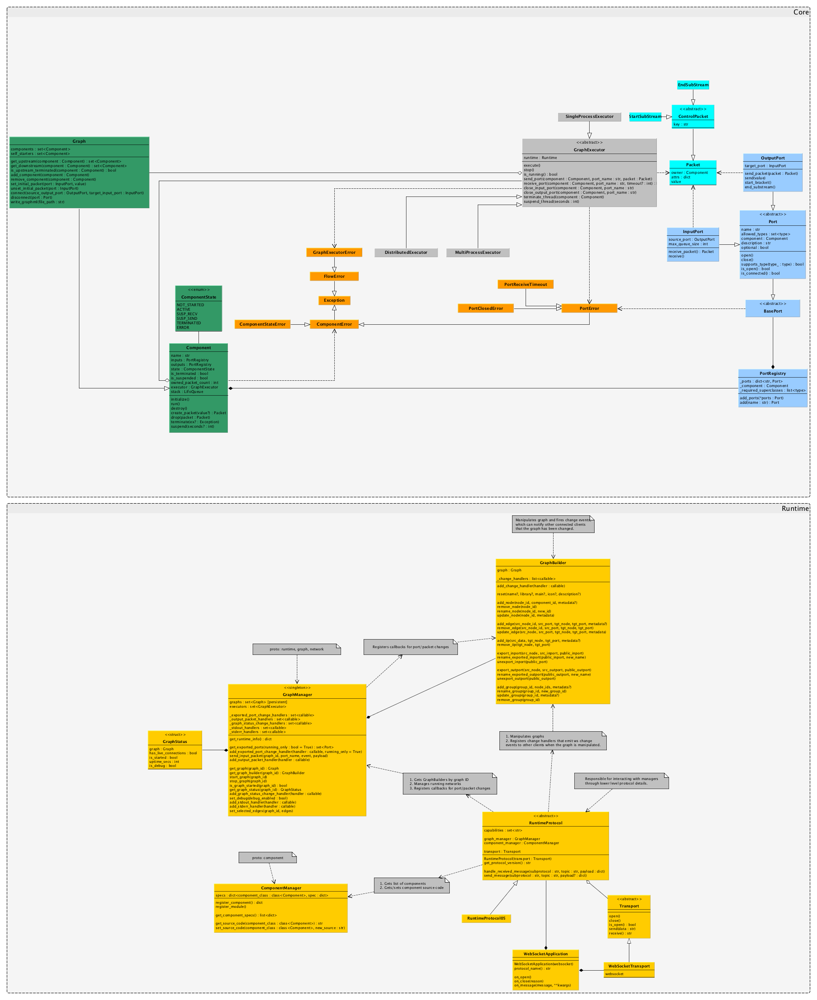

# pflow

[](https://travis-ci.org/LumaPictures/pflow)
[](https://coveralls.io/github/Flushot/pflow?branch=master)

**THIS PROJECT IS STILL IN ITS VERY EARLY STAGES**

## What is this?

This is a Python implementation of the [flow-based programming](http://www.jpaulmorrison.com/fbp/) paradigm, which allows people to create programs as graphs. This means we no longer have to write code, but can visually design our programs in a drag-and-drop style, using pre-defined generalized black-box components.

You can define data flow execution graphs ([DAGs](https://en.wikipedia.org/wiki/Directed_acyclic_graph)) where each process (node) is run as a parallel black box that processes input data and spits out something to send downstream. To design these graphs, you can use some freely available design tools such as [DrawFBP](https://github.com/jpaulm/drawfbp), [NoFlo UI](https://github.com/noflo/noflo-ui), or [Flowhub](https://flowhub.io/).

To understand what this is all about, perhaps it's easier to quote [J. Paul Morrison](http://jpaulmorrison.com/), the inventor of flow-based programming:

> In computer programming, Flow-Based Programming (FBP) is a programming paradigm that uses a "data factory" metaphor 
for designing and building applications. FBP defines applications as networks of "black box" processes, which exchange 
data across predefined connections by message passing, where the connections are specified externally to the processes. 
These black box processes can be reconnected endlessly to form different applications without having to be changed 
internally. FBP is thus naturally component-oriented.


## Quick Start

Run `python setup.py develop` to symlink site-packages to this repo, 
then run the example graphs with `./example.py`.


## Graphs

To define and execute a graph, subclass `pflow.core.Graph`, override `initialize()` to construct the graph,
then run it using a `GraphExecutor` implementation:

```python
from pflow.executors.single_process import SingleProcessGraphExecutor
from pflow.components import *


class MyGraph(Graph):
    def initialize(self):
        tail_1 = FileTailReader('TAIL_1')
        self.set_initial_packet(tail_1.inputs['PATH'], '/var/log/system.log')

        filter_1 = RegexFilter('FILTER_1')
        self.set_initial_packet(filter_1.inputs['REGEX'],
                                r' (USER|DEAD)_PROCESS: ')

        self.connect(tail_1.outputs['OUT'], 
                     filter_1.inputs['IN'])

        self.connect(filter_1.outputs['OUT'],
                     ConsoleLineWriter('LOG_1').inputs['IN'])    


graph = MyGraph('MY_GRAPH_NAME')
executor = SingleProcessGraphExecutor(graph)
executor.execute()
```

Components are connected by their ports by calling `Graph.connect(source_output_port, target_input_port)`.

Any time `Graph.connect()` is called, the components associated with the ports will automatically get added to the
graph. If (in the rare case) you have a graph with a single component, you'll need to register it by calling
`Component.add_component()`.


## Components

You can find some premade components in the `pflow.components` module. If you can't find what you need there,
you can always create a custom component by subclassing `pflow.core.Component`, then overriding the `initialize()` 
and `run()` methods:

```python
from pflow.core import Component, InputPort, OutputPort, EndOfStream, keepalive


class MySleepComponent(Component):
    '''
    Receives input from IN, sleeps for a predetermined amount of time,
    then forwards it to output OUT.
    '''
    def initialize(self):
        self.inputs.add(InputPort('IN'))
        self.outputs.add(OutputPort('OUT'))

    @keepalive
    def run(self):
        input_packet = self.inputs['IN'].receive_packet()
        if input_packet is EndOfStream:
            self.terminate()
        else:
            time.sleep(5)
            self.outputs['OUT'].send_packet(input_packet)
```

### Component Design

Rules for creating components:

* Your component should generally [be small and do one thing well](http://c2.com/cgi/wiki?UnixDesignPhilosophy).
* The `Component.initialize()` method is used for setting up ports and any initial state.
* The `Component.run()` method is called by the runtime only once before the component is automatically terminated.
  If you don't want this behavior, you can either write your code in a `while self.is_alive(): ...` loop or
  simply decorate the `run()` method with `@keepalive`. If you decide to use the decorator, you must explicitly
  `terminate()` the component when you are finished.
* Call `Component.suspend()` if you need to be explicit about suspending execution (typically done in loops or when 
  waiting for some asynchronous task to complete).
* Calls to `Port.send*()` or `Port.receive*()` suspend execution while waiting for data to arrive, so that they do 
  not block other processes.
* You should always check that the return value of `Component.receive()` or `Component.receive_packet()` is not the
  sentinel object `EndOfStream`, denoting that the port was closed.


### Component States


| State | Description |
| ----- | ----------- |
| **NOT_INITIALIZED** | Comonent hasn't been initialized yet (initial state). | 
| **INITIALIZED** | Component is initialized, but hasn't been run yet. |
| **ACTIVE** | Component has received data and is actively running. |
| **SUSP_SEND** | Component is waiting for data to send on its output port. |
| **SUSP_RECV** | Component is waiting to receive data on its input port. |
| **TERMINATED** | Component has successfully terminated execution (final state). |
| **ERROR** | Component has terminated execution because of an error (final state). |


### Class Diagram




# Using the UI

## Installing

```
npm install -g n
npm install -g bower
npm install -g grunt-cli
sudo n 0.10

mkdir noflo
cd noflo

git clone https://github.com/noflo/noflo-ui
cd noflo-ui
git checkout 0.10.0
npm install
# running bower before grunt prompts to resolve a dependency conflict which otherwise causes grunt to fail
bower install
grunt build
python -m SimpleHTTPServer 8000
```

## Running

1. Open your browser to `http://localhost:8000/`
2. Log in using your github account. Go to setting and copy your "User Identifier"
3. In a fresh shell, `cd` into the root of the pflow repo.
4. Start the pflow runtime.
   ```
   python -m pflow.runtime --user-id <USER_ID>
   ```
5. Back in the browser, create a new project in NoFlo selecting the pflow runtime
6. Green arrows should appear on the top-right menu, right before
   `ws:\\localhost:3569`

# Testing

First install the test suite:
```
nmp install -g fbp-protocol
```

Then, from the repo directory, run the tests
```
fbp-test
```
